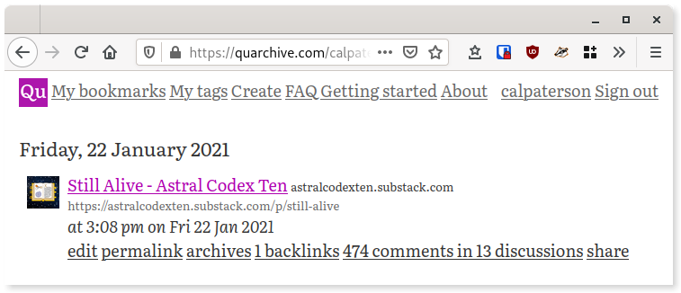

<div align="center">
    
</div>

# Quarchive

This is the full source code for [Quarchive](https://quarchive.com/about), a
bookmarking site which shows metadata around your browser bookmarks.

This is beta quality software, licensed under AGPLv3 or later.

## Overview



Quarchive has a number of features, including:

- Full text search (of the contents of the bookmark)
- Finding discussions on HN and Reddit
- Finding links/backlinks between your bookmaks
- Tagging
- Hooking in to the browser bookmark system via an extension - so you can use
  "Ctrl-D" to bookmark as normal and the bookmarks will by synced
- It will even pick up mobile bookmarks, if you have normal browser sync turned
  on between your mobile browser and your desktop browser
- It's Free and open source

## Technical

It consists of a web server and a browser extension (that syncs your bookmarks with the server).

### Building

To build the server you will need Python 3 and tox.  To build the browser
extension you will need npm.

Build both with:

```make```

If this doesn't work out of the box, perhaps looking at the [github build script](.github/workflows/ci.yml) will help
